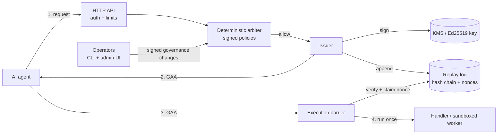
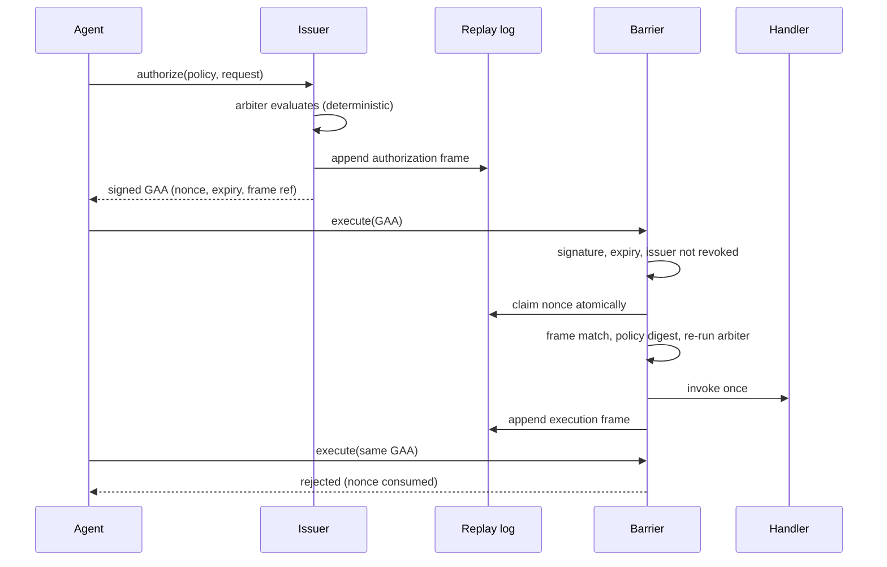
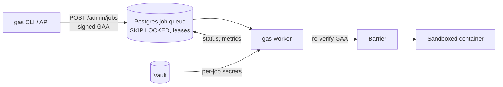

# Governed Autonomy Substrate (MVP)

[](https://github.com/FreeMason9226/governed-autonomy-substrate/actions/workflows/ci.yml)
[](https://freemason9226.github.io/governed-autonomy-substrate/)
[](https://codespaces.new/FreeMason9226/governed-autonomy-substrate)

A cryptographic authorization barrier for AI agents: **no signed artifact, no action.** Every action must carry a short-lived, single-use, Ed25519-signed Governance Authorization Artifact (GAA) that matches an audited, hash-chained log entry and the current policy.

## Try it

- **Full pipeline walkthrough:** [request, policies, risk score, decision, execution, signed proof, audit trail](https://freemason9226.github.io/governed-autonomy-substrate/pipeline.html) (risk score is a demo heuristic); tick *Use the real server* to run approved `write_file` requests against the live sandbox below.
- **In your browser (no install):** [protocol simulation](https://freemason9226.github.io/governed-autonomy-substrate/) - authorize, execute, then try replaying and tampering.
- **The real server:** click *Open in Codespaces* above; `gas-server` starts on port 8000 (admin UI at `/admin`, token `codespaces-operator-token`). Demo credentials only.
- **Live sandbox (real server):** <https://gas-demo.onrender.com> - send `Authorization: Bearer public-demo-token`; try `POST /authorize` then `POST /execute` ([curl walkthrough](docs/deployment-walkthrough.md#2-authorize-and-execute)). Free tier: the first request after idle takes ~1 minute; state resets on restart.
- **Public sandbox (real server, memory mode):** [](https://render.com/deploy?repo=https://github.com/FreeMason9226/governed-autonomy-substrate) deploys `render.yaml` (free plan, demo bearer token `public-demo-token`, random operator token, no persistence). Do not put real data in it. Every route, including `/livez` and `/admin`, requires an `Authorization: Bearer` header.
- **Locally:** `pip install -e . && gas-demo && gas-server` - see the [deployment walkthrough](docs/deployment-walkthrough.md).

## Architecture at a glance



### Authorize, then execute



### Durable execution: job queue and worker



## Documentation

| Topic | Doc |
|---|---|
| Policy schema, versioning and registry | [docs/policy-schema.md](docs/policy-schema.md) |
| Deploy end to end (local, Compose, Postgres, Helm) | [docs/deployment-walkthrough.md](docs/deployment-walkthrough.md) |
| Security model and hardening checklist | [docs/security-model.md](docs/security-model.md) |
| Performance benchmarks | [docs/benchmarks.md](docs/benchmarks.md) |
| Operations runbook | [docs/operations.md](docs/operations.md) |
| Specification and conformance | [SPEC.md](SPEC.md), [docs/conformance.md](docs/conformance.md) |
| Integrations | [A2A](docs/integrations/a2a.md), [LangChain](docs/integrations/langchain.md), [MCP](docs/integrations/mcp.md) |
| Patent mapping | [PATENT_TO_CODE_MAPPING.md](PATENT_TO_CODE_MAPPING.md) |

**Performance headline** (laptop, single process): full authorize + execute in ~0.37 ms in memory (about 2,700 cycles/s), ~5 ms over HTTP; durable SQLite ~24 ms. Details and caveats in [docs/benchmarks.md](docs/benchmarks.md).

---

This repository contains the first working slice of a governance authorization and execution barrier. It issues a signed **Governance Authorization Artifact (GAA)**, records the authorization as an append-only replay frame, and permits an action callable to run only after every barrier check succeeds.

## Architecture

1. `GovernanceAuthorizationArtifact` binds an action request, policy decision, expiry, nonce, replay-frame reference, issuer key ID, and Ed25519 signature using canonical JSON.
2. `ReplayLog` stores hash-chained frames. Its `load_jsonl` recovery path verifies every frame and reconstructs consumed nonces; `SQLiteReplayLog` persists those frames and consumed nonces transactionally across process restarts and fails closed if its stored chain is invalid. Append and nonce-claim operations are serialized for concurrent callers. An authorization frame captures the exact unsigned GAA payload and decision inputs; an execution frame records the result. `reconstruct_decisions()` and `audit_summary()` provide deterministic, replay-derived reconstruction of authorization history for audit and incident response.
3. `ExecutionBoundary` verifies the issuer signature, expiry, nonce uniqueness, referenced authorization frame, payload/frame equality, allow decision, and allowed-action constraint before atomically claiming the nonce and invoking the callable. With a `PolicyRegistry`, it also verifies the signed policy digest against the current trusted definition and re-runs the deterministic policy arbiter over the exact request to enforce `required_fields`, `exact_fields`, required/exact context, and size limits before execution. It records both completed and failed execution outcomes with bounded error metadata; successful results are hashed and only small JSON results are retained, preventing audit secrets and unbounded payloads. The atomic claim is locked for in-memory logs and transactional for SQLite, giving the barrier at-most-once authorization semantics under concurrent delivery; a failed action remains consumed and must be recovered through a separate compensating workflow.
4. `DeterministicArbiter` evaluates a request against a data-only `Policy`. Its output is stable for the same inputs and includes a canonical policy digest plus machine-readable denial reason codes, so clients do not need to parse human-readable prose and the exact policy contents are bound into the signed GAA decision rather than only a human-readable policy ID. `Policy.required_approvals` supports per-action approval quorum checks, allowing a request to carry a list of valid signed approvals and fail closed unless the required quorum is met.
5. `SignedApproval` is a detached, cryptographically bound approval record that carries the request digest, decision digest, signer key ID, actor context, and a valid Ed25519 signature. When the arbiter sees an `approvals` list, it verifies each signer and counts only valid, unique approvals toward the action's required quorum, which keeps the barrier fail-closed while allowing multi-party governance evidence.
6. `AuthorizationIssuer.authorize(..., approvals=...)` accepts signed approval evidence directly, binds those approvals into the authorization request, and records the authorization in the same append-only replay log as the artifact itself. This gives the issuer an explicit path for building multi-party governance authorizations without bypassing the execution barrier.
7. `RuntimeIdentity` and `GovernancePlatform` add the missing platform-shell layer: they bind service identity, environment, tenant, actor, and request metadata to a request before authorization, turning the barrier into a deployable runtime abstraction instead of only a local library. `PlatformDeploymentPolicy` additionally enforces allow-listed environments, tenant requirements, request IDs, source constraints, and runtime-context size limits so deploy-time guardrails fail closed before a signed GAA is issued.
8. `ServicePrincipal` and `ServicePrincipalRegistry` extend that layer with tenant-scoped service identities, explicit action/source/environment allowlists, and required-role checks, providing the missing identity-and-access boundary that a real platform needs before cross-tenant or privilege-escalation activity can reach the execution barrier.
9. `GovernancePlatform.authorize(..., mesh_inputs=...)` adds the runtime platform entrypoint for mesh-aware governance. It binds runtime context, deployment policy, and an optional `GovernanceSourceRegistry` so a platform service can authorize only after both the policy gate and the mesh-preflight evidence gate have passed.
10. `PolicyChangeManager` adds the missing governance operations layer: it can propose, approve, and activate policy rollouts with explicit quorum checks, so the platform has a path from policy review to safe runtime activation without bypassing the barrier.
10. `GovernanceRuleTranslator` converts human-readable governance statements such as `allow write_file when path is present and content is present` or `allow deploy when approvals >= 2` into canonical policy definitions, allowing policy authors to express intent in a machine-checkable form before issuing a signed GAA.
11. `AuthorizationIssuer` provides the end-to-end workflow: arbitrate, append an authorization frame, and issue a GAA. Denied requests are audited but never signed.
12. `TrustStore` manages issuer public keys and revocation. It supports retaining old keys during rotation while immediately blocking revoked issuers, validates its persisted schema on load, and atomically replaces its JSON file on update.
13. `GovernedService` binds policy IDs and action names to explicit application handlers, preventing callers from supplying arbitrary callables at execution time. It accepts `PolicyRegistry` directly (or converts the legacy dictionary form into one), can bind a shared `GovernanceSourceRegistry` into the issuer path for runtime mesh preflight, and exposes `audit_report()` for a deterministic snapshot of actions, policy IDs, replay health, and mesh-source trust status when configured.
14. `GovernanceAuthorizationArtifact.from_dict` and `from_json` strictly parse transport representations, making `GovernedService.execute_dict` and `execute_json` suitable for a future HTTP or queue adapter without field coercion.15. `PolicyRegistry` prevents accidental reuse of a policy ID with different contents and exposes the canonical digest of every registered policy.
16. `SignedPolicyManifest` binds a policy definition, version, and policy-authority issuer signature; registries can accept only manifests verified by the trusted issuer store and reject stale/conflicting rollbacks. `PolicyRegistry` can also persist its signed-policy view to disk and rehydrate it on startup after validating the manifest signatures against the trust registry, and `to_dict()`/`from_dict()` provide a deterministic snapshot format for portable governance configuration.
17. `TrustStore.to_dict()` and `PolicyRegistry.to_dict()` expose JSON-friendly snapshots so a trusted issuer registry and policy set can be exported, verified, and reloaded without re-inventing the governance configuration. `GovernanceSourceRegistry.to_dict()` now does the same for mesh-source trust metadata, storing canonical base64 public keys and revocation state in a replay-safe snapshot that can be reloaded with `from_dict()`.
18. `ReplayLog.events` and `events_for_nonce` provide read-only audit queries for authorization and correlated execution outcomes without exposing storage internals. Execution frames include their authorization frame reference and policy ID.
19. `AuthorizationIssuer.authorize_compensation` issues a new, separately signed GAA only after an audited failed execution, linking the compensating request to the failed nonce instead of retrying the consumed artifact.
20. `health_report` provides a readiness-oriented structured check for replay integrity and configured trust/policy components.
21. `build_demo_service` wires the complete issuer, trust store, policy registry, boundary, replay log, and named action handler for integration use.
22. `AuthenticatedAPI` and `create_server` expose an authenticated standard-library HTTP boundary with `/health`, `/authorize`, and `/execute`, strict body limits, and JSON-only transport.

## Threat model and limitations

The boundary assumes issuer public keys are provisioned through a trusted channel and that the process and replay-log filesystem are not already compromised. Ed25519 provides authenticity and integrity, while canonical JSON prevents equivalent representations from signing different bytes. The JSONL log is append-only by API and hash-chained; SQLite adds durable frames and nonce indexing. The package now exposes integration boundaries for OIDC validation, remote signing, managed nonce storage, TLS, and rate limiting, but those controls still depend on correctly operated external providers. Action results are audit data and should not contain secrets. Execution is at-most-once at the authorization layer, not an end-to-end transactional guarantee for arbitrary external side effects.

The included arbitration layer is deliberately narrow: it supports allowed actions, required fields, exact field constraints, required/exact actor or scope context, approval quorum checks via `required_approvals`, a configurable canonical request-size limit, and a maximum authorization TTL. Policy definitions validate their names and deterministic ordering at construction and expose stable canonical digests; signed manifests are verified against a trusted local issuer store before the registry accepts them. It does not provide a general-purpose policy language, resource isolation, or semantic validation of action parameters. External identity validation and distributed nonce coordination are adapter boundaries, not substitutes for a managed identity provider or a highly available database deployment.

The service facade is intentionally in-process. A network adapter can translate authenticated requests into `authorize` and `execute` calls, but transport authentication and authorization remain deployment responsibilities.

The included HTTP adapter supports bearer authentication, request correlation, security headers, bounded rate limiting, API-enforced role-based authorization, and optional TLS wrapping through `create_server(..., tls=TLSConfig(...))`. It remains a minimal deployment boundary: token rotation, ingress policy, certificate lifecycle, WAF controls, and network-level authorization remain deployment responsibilities. The admin UI is a dependency-free operational surface and does not yet hide controls based on a user's role; the API enforces each role boundary regardless of the UI.

## Patent-to-code traceability

For the patent draft mapping, see [PATENT_TO_CODE_MAPPING.md](PATENT_TO_CODE_MAPPING.md).

## Patent draft with NIST integration

This repository also contains a provisional patent draft excerpt for the
Governed Autonomy Operating System (GAOS), integrated with a mapping to the
NIST Cybersecurity Framework (CSF) and NIST incident response guidance
(SP 800-61r2 / 800-53).

Files:

- `patent_with_nist_integration.md` — Patent draft excerpt with NIST mappings
- `compliance_mapping.csv` — Tabular mapping of GAOS components to NIST controls
- `ir_playbooks/` — Example IR playbooks aligned to SP 800-61r2

Usage:

- Use the GIR to ingest regulatory sources and generate machine-enforceable
  governance objects.
- Use the replay engine and integrity ledger for deterministic replay and
  forensic validation.
- Follow the IR playbooks in `ir_playbooks/` for incident handling and
  evidence preservation.

License: Proprietary (Provisional patent pending). Contact: Mason (repo owner).

## Run

```powershell
python -m pip install -e . pytest
python -m pytest
gas-demo
GOVERNED_AUTONOMY_BEARER_TOKEN=my-secret gas-server --host 0.0.0.0 --port 8000
```

`gas-demo` writes `replay.jsonl` in the current directory. `gas-server` starts the standard-library HTTP API with bearer-token auth for `/health`, `/audit`, `/authorize`, and `/execute`. For a production deployment, replace the in-memory replay index with a transactional durable store and provision public keys from a managed trust store.

## Production-sensible integration boundaries

The package now includes runnable boundaries for the next deployment slice:

* `OIDCValidator` validates compact JWTs fail-closed (issuer, audience, expiry, not-before, algorithm, key id, and signature) against an injectable `JWKSProvider`. `UrlJWKSProvider` retrieves keys over HTTPS, bounds responses to 1 MiB, serializes concurrent refreshes, caches detached public-key data until expiry, and detects key-material rotation (including replacement under an unchanged key ID); refresh failures fail closed rather than trusting expired keys. OIDC discovery exposes the issuer, authorization/token endpoints, JWKS URI, and advertised signing algorithms; validators intersect provider algorithms with their configured allow-list. Use `validate()` in synchronous handlers or `await validate_async()` from async services; the async method runs blocking key retrieval and cryptography off the event loop. Validated claims are returned in `ExternalIdentity` and normalized to `RuntimeIdentity` (subject, tenant, display name, email, mapped roles and groups). OIDC identity context is server-bound to authorization requests and overrides caller-supplied identity fields, so policies and audit attribution use verified claims rather than request-body identity. `EntraOIDCConfig` and `entra_oidc_validator_from_discovery()` provide single-tenant Microsoft Entra ID setup from `ENTRA_TENANT_ID` and `ENTRA_CLIENT_ID`. Configure `ENTRA_REDIRECT_URI` to enable the server-side Authorization Code + PKCE flow at `/auth/login`; the callback validates state, nonce, tenant, ID-token signature and claims before setting an HttpOnly session cookie. Browser sessions are process-local, limited to one Helm replica, and shared bearer tokens remain restricted to health probes in Entra-only mode. A provider can implement `refresh()` to support key rotation without putting network policy in the validator.
* `LocalEd25519Signer`, `RemoteSigner`, and `KMSSigner` implement the `Signer` protocol. `KMSSigner` is the KMS/HSM adapter boundary: it accepts a KMS backend with a `.sign(key_id, payload)` callback and optional public-key fetch, keeping private keys outside the process and leaving hardware-backed key custody to the deployment environment.
  `build_runtime_service(signer=...)` can inject that signer into the PostgreSQL runtime; omitting it preserves the explicit local-key environment path.
* `SQLiteNonceRepository` performs transactional, unique nonce claims. `PostgresNonceRepository` and `POSTGRES_NONCE_SCHEMA` define the managed-database adapter boundary without making a PostgreSQL client a mandatory dependency.
* `TLSConfig`, bounded rate limiting, correlation IDs, and security headers are available to deployment code. The standard-library API supports `Bearer` authentication (and retains its legacy direct-token form), an `/admin` dashboard, and JSON slices for policies, proposals, metrics, and trust snapshot.
* The admin dashboard (`/admin`, `/admin/app.js`, `/admin/app.css`) is a dependency-free browser workflow UI: it can propose, approve, and activate policy changes end to end, and add or revoke trusted issuer keys. Signing happens entirely client-side with the Web Crypto API (Ed25519 over the exact bytes returned by `/admin/proposals/prepare`, `/admin/proposals/{id}/prepare-approval`, `/admin/trust/keys/prepare`, and `/admin/trust/keys/{key_id}/revoke/prepare`); private key material is pasted into the page for a session and never leaves the browser or touches the server, which only ever sees signatures and public key ids.
* `TrustChangeManager` governs trust-store changes with the same "prepare exact bytes, sign externally, submit" pattern as `PolicyChangeManager`: adding or revoking a trusted key requires a valid signature from an already-trusted, non-revoked key, so the server never needs private key material and a revoked key immediately loses the ability to authorize further trust changes.
* Policy proposal/approval/activation and trust/operator key lifecycle changes are recorded as `"governance"`-typed frames in the same durable, hash-chained `ReplayLog` used for authorization/execution events (`GET /admin/governance-log`, surfaced in the admin dashboard's Audit tab). Events include the authenticated OIDC subject or operator key ID; the shared-token fallback is explicitly labeled `shared-token`. The log persists across restarts whenever backed by `SQLiteReplayLog` or `PostgresReplayLog`, rather than the pure in-memory default.
* Admin access can use role/scope-authorized OIDC identities or the bootstrap `GOVERNED_AUTONOMY_OPERATOR_TOKEN`. For individually attributable, revocable credentials, configure `GOVERNED_AUTONOMY_OPERATOR_KEY_STORE` (or `--operator-key-store`) with a SQLite database path. An already-authorized OIDC operator or bootstrap-token holder can create, list, and revoke keys at `/admin/operator-keys`; each random bearer token is returned once, only its SHA-256 hash is persisted, and the key is restricted to `/admin` routes. The dashboard's Operator Access tab supports key lifecycle management. Protect the SQLite file and serve the API over TLS.

These are integration-ready slices, not claims that this repository provisions an HSM, PostgreSQL cluster, OIDC discovery client, TLS certificate, or production ingress. Those must be supplied and operated by the deployment environment. The admin UI intentionally has no browser-side secret persistence (keys are memory-only and cleared after signing) and all state-changing governance operations remain behind the existing signed service APIs, quorum/separation-of-duties checks in `PolicyChangeManager`, and trusted-signer checks in `TrustChangeManager`.

## Production foundation artifacts

The repository also includes a durable SQLite job state model (`SQLiteJobStore`)
with idempotency, bounded retries, dead-letter state, and compensation hooks;
PostgreSQL replay/nonce schema and adapter boundaries; Prometheus text and
OpenTelemetry-compatible hooks; versioned `/api/v1` endpoints and
`/openapi.json`; and liveness/readiness/startup probes. `Dockerfile`,
`compose.yaml`, `deploy/kubernetes.yaml`, `deploy/helm/values.yaml`, and
`docs/operations.md` provide deployment and recovery starting points. They do
not provision a database, identity provider, certificates, backup system, or
cloud credentials.

## Multi-organization federation

The `federation` layer synchronizes policy registries without trusting remote state blindly. A `RegistrySnapshot` is a deterministic, canonical summary of policy entries and their individual digests; its content digest is portable across organizations while the source organization remains authenticated by the signed event. `SignedSyncEvent` binds the event type, source and target organizations, snapshot digest, per-policy digests, issuance timestamp, nonce, and signer key. `GovernanceSyncEnvelope` signs the complete event-plus-snapshot payload, preventing an intermediary from swapping either component.

`GovernanceReconciler` requires an explicit organization-to-key mapping and the same `TrustStore` used by the authorization substrate. It rejects unknown organizations, unregistered or revoked keys, invalid signatures, stale events, replayed nonces, snapshot tampering, unstable policy IDs, and policy digest mismatches. Identical content is a no-op; signed unknown policies can be imported; conflicting definitions for an existing `policy_id` produce explicit conflict metadata and are never silently merged. Policy manifests are independently verified before import, so federation signatures do not substitute for policy-authority trust.

This slice provides deterministic single-process reconciliation and an auditable result object. Production deployments still need durable consumed-event nonce storage, organization-key lifecycle/distribution, transport confidentiality, cross-region ordering/leases, and an external audit sink. The reconciler intentionally does not resolve conflicting policy definitions automatically.

## Governance mesh preflight

`GovernanceMesh` is the bounded governance-harmonization layer between independent governance sources and authorization. Each typed `GovernanceInput` carries a unique source ID, canonical decision, weight, priority, and optional metadata. The mesh groups equivalent decisions by SHA-256 of canonical JSON, ranks groups deterministically by total weight, priority, and digest, and returns a stable `GovernancePreflightDecision` with selected sources, input digests, reasons, and conflict metadata.

The mesh fails closed when highest-priority sources disagree on allow/deny. It can append a `governance_preflight` replay frame containing the request digest, input provenance, decision digest, and optional authorization-frame reference. This provides deterministic preflight evidence without replacing the signed GAA execution boundary. It is not predictive machine learning or an attestation system: production deployments still need authenticated source adapters, durable replay storage, source health/quality policy, and explicit handling for stale or unavailable external governance feeds.

## Replay divergence verification

`ReplayLog.verify_integrity()` provides deterministic replay evidence for audit and incident response. It rechecks every hash-chain link, detects duplicate frame IDs, and returns a stable replay digest, head hash, frame count, and first integrity error without mutating the log. `events()` and `events_for_nonce()` now return detached event copies, preventing callers from changing retained audit evidence accidentally.

This verifies local evidence only. A production deployment still needs external tamper-evident retention, signed replay attestations, cross-node comparison, and an operational response when divergence is detected.

### Mesh preflight at authorization

`AuthorizationIssuer.authorize(..., mesh_inputs=...)` optionally requires the deterministic governance mesh to preflight the exact canonical request before a GAA is issued. The resulting mesh digest is included in the signed decision and authorization replay frame. A denied or conflicted mesh result is audited as a denied authorization and never produces a GAA. Existing callers that omit `mesh_inputs` retain the original arbitration path; production deployments should supply authenticated governance-source adapters and treat mesh evidence as an additional gate, not a replacement for policy enforcement.

At execution, mesh-enabled authorization frames also carry the canonical, typed input evidence and request digest. `ExecutionBoundary` reconstructs the mesh from that replay-bound evidence and rejects malformed, conflicting, tampered, mismatched, or digest-divergent evidence before claiming the nonce or invoking the action. This is local replay evidence: deployments still need authenticated source adapters and durable, independently protected replay retention. Artifacts issued without `mesh_inputs` intentionally retain the legacy execution path.

`GovernanceInput.attest()` provides a compact source-adapter boundary: a source signs its canonical ID, decision, weighting, priority, and metadata, and `GovernanceMesh(trusted_sources={...})` verifies that signature and the source-ID-to-key binding before aggregation. `GovernanceSourceRegistry` adds explicit source registration, metadata, and revocation semantics for a platform-level mesh trust domain, and its JSON snapshot is canonicalized so the registry can be safely persisted and reloaded without exposing raw key material. This is an opt-in local trust registry, not a network identity provider or key-rotation service; deployments must provision and rotate trusted source keys securely.

Policies can also require mesh evidence at the authorization boundary. `Policy.required_mesh_inputs`, `Policy.required_mesh_sources`, `Policy.mesh_required_actions`, and `Policy.mesh_required_environments` let a governed action require signed mesh provenance for selected actions or runtime environments, and `PlatformDeploymentPolicy` enforces the same requirement at the platform layer. A missing, malformed, or source-mismatched mesh input fails closed before a signed GAA is issued, while legacy artifacts and policies without mesh requirements continue to take the existing path.

## Platform slice: KMS, key lifecycle, sandboxed workers, operator CLI

* `AwsKmsBackend` (`pip install .[aws]`) plugs into `KMSSigner`; use an `ECC_NIST_EDWARDS25519` KMS key so signatures stay Ed25519. See `deploy/security/aws-kms-iam-policy.json` (sign/get-public-key only; export/decrypt denied).
* `KeyLifecycleManager` tracks ACTIVE → ROTATED → REVOKED keys against the `TrustStore` (rotated keys remain verifiable; revoked keys are untrusted immediately).
* `WorkerRuntime` executes `SQLiteJobStore` jobs in a `ContainerSandbox` (allow-listed images, no network, read-only root, all caps dropped, argv-only commands, secrets passed via environment and redacted from output). An injected `authorizer` must return the signed, authorized job spec — typically `lambda p: service.execute_json(p["artifact"])` — so queued fields are never trusted and artifact replay is rejected by the barrier. `VaultSecretProvider` fails closed on missing paths/keys. Helm `worker.*` values (disabled by default) add a locked-down Deployment and egress-restricted NetworkPolicy; apply `deploy/security/vault-worker-policy.hcl` in Vault.
* `gas` CLI: `gas auth login|status`, `gas operator-key list|create|revoke`, `gas policies|trust|metrics|audit|governance-log`, `gas replay verify <replay.jsonl>`. Credentials are stored owner-only in `~/.gas/credentials.json` (override with `GAS_HOME`, `GAS_API_URL`, `GOVERNED_AUTONOMY_OPERATOR_TOKEN`). Signed policy/trust changes remain in the admin dashboard.

* `PostgresJobStore` (same `JobStore` interface as `SQLiteJobStore`) claims with `FOR UPDATE SKIP LOCKED` so many worker replicas can share one queue, and reclaims jobs from crashed workers after a lease expires. `gas-worker` (`governed_autonomy.worker_main`) polls it and runs jobs whose payload is `{"artifact": "<signed GAA json>"}`; the artifact is verified and consumed through the execution barrier and its action must return the job spec (`image`, `command`, optional `policy_id`/`required_secrets`). Register such an action on your service, set `GAS_WORKER_IMAGES`, and enable the Helm `worker.*` values.
  `gas-server` automatically uses this same PostgreSQL queue when `DATABASE_URL` is configured, so `POST /admin/jobs` submissions reach the workers. Submit the GAA returned by `/authorize` as its JSON object or serialized JSON; the API serializes objects for the worker, which verifies the signature before execution. Install `.[postgres]` for both processes. For local/single-process use, `GOVERNED_AUTONOMY_JOB_STORE` or `--job-store <path>` explicitly selects SQLite instead. Operators can check progress at `GET /admin/jobs/{job_id}`; both routes require admin authorization and the status route omits the queued payload.
* `build_demo_service` and `build_runtime_service` include `demo-jobs-v1`, a minimal signed job-spec policy for integration tests and demos. The kind workflow runs `gas-worker` on the CI runner's Docker host against the cluster's PostgreSQL queue; the Helm worker pod intentionally does not mount a host container socket. Production Kubernetes execution needs a separately configured sandbox backend—do not mount the node's container socket into the worker.

* Set `GAS_WORKER_METRICS_PORT` (and optionally `GAS_WORKER_METRICS_HOST`, default `127.0.0.1`) to expose worker `/metrics` in Prometheus format: `governed_autonomy_worker_jobs_{processed,succeeded,retried,dead_lettered,denied}_total`. Bind to `0.0.0.0` only behind the worker NetworkPolicy/ServiceMonitor you configure.
