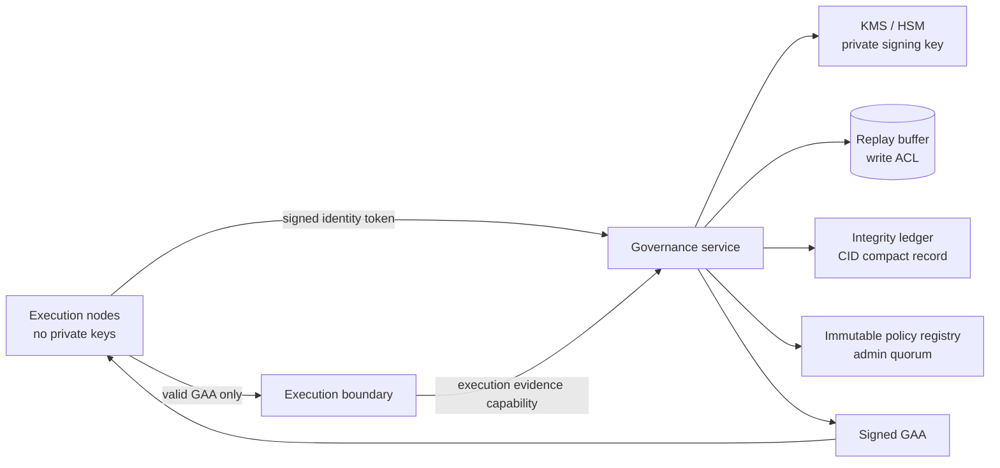

# Enforced Separation Architecture

Execution images contain no issuer private key. Network policy permits governance calls
only through the governance service endpoint; replay persistence and KMS access are not
exposed to execution pods.