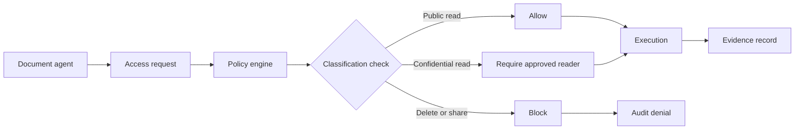

# Document Access Demo

## Problem statement

Autonomous document agents can request read, write, delete, and share operations across enterprise document stores. Without governance, an agent can bypass classification boundaries or share content externally. GAS binds document access to policy evaluation and audit evidence before access is executed.

## Architecture

The document access demo uses the same policy and barrier runtime as the broader platform, scoped to safe local fixtures for SharePoint, OneDrive, and Amazon S3. That keeps the demonstration deterministic while exercising the real governance path.

## Workflow diagram

## Governance decision path

1. Determine document classification and target provider.
2. Check the document action against the applicable policy.
3. Enforce public/confidential restrictions and external share protections.
4. Require a valid authorization boundary before read, write, delete, or share.
5. Record the policy decision and execution result in the evidence trail.

## Generated evidence

Each request logs:

- document identifier,
- user identity,
- requested operation,
- policy decision,
- policy version,
- execution result,
- timestamp,
- audit digest or replay reference.

## Screenshots placeholder

## Business impact

This pattern reduces accidental exposure of confidential content, blocks unauthorized deletion, and preserves a complete evidence log suitable for compliance and internal review. It gives enterprise reviewers a concrete, auditable policy path for document access rather than a one-off access control list.
