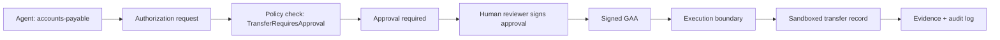

# Financial Approval Demo

## Problem statement

An autonomous finance agent can generate a $100,000 transfer request. Without governance controls, the request would reach the payment rail without a human check, risk control, or verifiable audit trail. GAS changes that by requiring a signed Governance Authorization Artifact (GAA) and a policy-based approval workflow before execution.

## Architecture

The demonstration uses the real governance runtime in the repository:

- policy registry,
- authorization issuer,
- replay log,
- execution barrier,
- signed approval artifact,
- audit report generation.

The workflow intentionally exercises the same production path used by the broader governance engine instead of a mock-only stub.

## Workflow diagram

## Governance decision path

1. Submit a WireTransfer request for $100,000 USD.
2. Evaluate `TransferRequiresApproval-v1`.
3. Detect that approval is required before execution.
4. Sign an approval artifact with the approver key.
5. Re-run authorization with the signed approval attached.
6. Allow only a policy-consistent artifact through the execution boundary.
7. Record the replay and execution evidence.

## Generated evidence

The runtime stores structured evidence including:

- requestor identity,
- approver identity,
- policy evaluated,
- policy result,
- reason for decision,
- GAA identifier,
- timestamp,
- signature verification status,
- replay log integrity.

## Screenshots placeholder

## Business impact

This protects the organization from unauthorized or accidental wire transfers, creates a clear human approval record, and produces evidence suitable for audit and internal review. It turns an autonomous action into a governed decision with cryptographic accountability.
