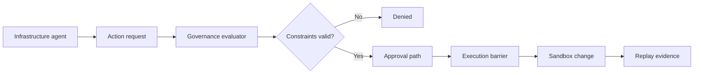

# Infrastructure Agent Demo

## Problem statement

Infrastructure automation agents can create resources, modify firewall rules, scale clusters, or delete environments without a governance layer. Those actions create operational risk in production and can exceed cost or environment constraints. GAS applies policy, approval, and replay enforcement before actions are executed.

## Architecture

The infrastructure demo exercise uses the actual policy engine and execution barrier against a safe local sandbox. The runtime enforces:

- cost ceilings,
- environment restrictions,
- production protection,
- approval requirements,
- replay-based execution control.

## Workflow diagram

## Governance decision path

1. Receive a requested action such as `CreateVirtualMachine` or `DeployCluster`.
2. Validate environment, cost, and constraints.
3. Require approval for high-impact actions.
4. Execute only if the signed artifact and policy check pass.
5. Persist the evidence chain to the replay log.

## Generated evidence

The infrastructure audit output includes:

- requested action,
- environment,
- policy outcome,
- constraints evaluated,
- execution status,
- replay identifier,
- timestamp,
- denial or approval reason.

## Screenshots placeholder

## Business impact

This keeps autonomous infrastructure operations within enterprise guardrails, prevents dangerous actions from being executed automatically, and creates a deterministic record of what was requested, approved, and executed. That gives engineering and security teams a materially stronger control model than raw automation alone.
