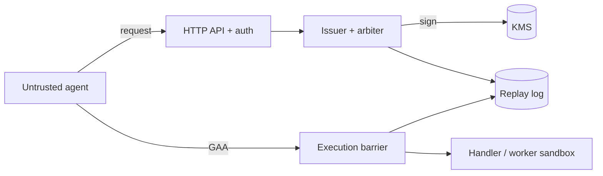

# Security model

This document describes what the Governed Autonomy Substrate (GAS) protects, who it trusts, and what it deliberately does not guarantee. See also the README "Threat model and limitations", [`SPEC.md`](../SPEC.md) and [`operations.md`](operations.md).

## Core guarantee

> An action handler runs **only if** a signed, unexpired, unconsumed Governance Authorization Artifact (GAA) from a trusted, non-revoked issuer matches an `allow` frame in the replay log and the current policy.

The barrier is *fail closed*: any missing, malformed, expired, revoked or mismatched input results in denial.

## Assets and trust boundaries

| Asset | Where | Trusted party |
|---|---|---|
| Issuer private key | KMS (production), env/in-memory (dev) | Issuer service only |
| Trust store (issuer public keys, revocations) | Postgres / JSON file | Operators with signed governance changes |
| Policy registry (signed manifests) | Postgres / file | Policy authority key |
| Replay log + consumed nonces | Postgres / SQLite | Append-only, hash-chained |
| Operator credentials | Token, operator keys, OIDC role | Operators |
| Worker credentials | Vault (short-lived) | Worker sandbox |

Agents are untrusted. The API, issuer and barrier form the trusted computing base (TCB).

## Threats and controls

| Threat | Control | Code |
|---|---|---|
| Forged artifact | Ed25519 signature over canonical JSON; issuer must be in trust store | `crypto.py`, `models.py`, `trust.py` |
| Field tampering | Signature covers every field; payload must equal the logged authorization frame | `engine.py` |
| Replay / double execution | Nonce claimed atomically before the handler runs; failed actions stay consumed | `engine.py`, `replay.py` |
| Stale authorization | `expires_at` enforced by the barrier | `engine.py` |
| Policy drift / downgrade | Policy digest in the GAA must match the current signed registry; arbiter is re-run at execution | `policy.py`, `engine.py` |
| Log tampering or rollback | Hash-chained frames; load verifies every frame and fails closed | `replay.py` |
| Key compromise | Revocation in the trust store takes effect immediately; rotation retains old public keys only for verification | `key_lifecycle.py`, `trust.py` |
| Key theft at rest | KMS-backed signer: private key never leaves the KMS | `kms_backends.py` |
| Privilege escalation via queue fields | Jobs carry the signed GAA only; the worker re-verifies through the barrier and ignores unsigned fields | `jobs_postgres.py`, `worker.py` |
| Malicious action payload | Sandboxed container runner, secrets fetched per job from Vault | `worker.py`, `deploy/security/` |
| Unauthorized operator | Operator token, per-operator keys, or OIDC role; governance changes are signed client-side | `http_api.py`, `admin` |
| Request flooding / oversized bodies | Strict body limits, JSON-only transport, rate limiting | `http_api.py` |
| Supply chain | SHA-pinned Actions, Trivy, Bandit, SBOM, Dependabot | `.github/workflows/` |

## What is *not* guaranteed

- **At-most-once authorization, not exactly-once effects.** The nonce is consumed before the handler runs. If the handler fails or the process dies mid-way, the action is not retried automatically; recovery goes through `authorize_compensation`.
- **Side effects outside the barrier.** If a handler can be reached without presenting a GAA, GAS cannot stop it. Deploy handlers so the barrier is the only path.
- **Policy correctness.** GAS enforces the policy as written; it does not judge whether the policy is wise.
- **Compromised issuer or policy authority.** An attacker with the signing key (or KMS permission to sign) can mint valid artifacts. Restrict KMS IAM (see `deploy/security/aws-kms-iam-policy.json`) and monitor the governance log.
- **Denial of service.** The stdlib server is not hardened against volumetric attacks; use an ingress/WAF.
- **Time.** Expiry relies on host clocks; keep NTP healthy.

## Hardening checklist

- [ ] Use `GAS_RUNTIME_MODE=postgres` with TLS to the database; never the in-memory mode.
- [ ] Sign with KMS (`GAS_ISSUER_*` pointing at a KMS key); do not ship raw private keys in env.
- [ ] Replace the default bearer/operator tokens; store them in a secret manager (External Secrets template provided).
- [ ] Enable OIDC for operators and require signed governance changes.
- [ ] Enable the NetworkPolicy and run the worker with the sandbox runner and Vault policy from `deploy/security/`.
- [ ] Scrape `/admin/metrics` and enable the PrometheusRule alerts.
- [ ] Periodically run `gas replay verify` and archive the log.
- [ ] Rotate issuer keys on a schedule; revoke immediately on suspicion.
- [ ] Terminate TLS at the ingress and restrict ingress sources.

## Reporting vulnerabilities

Open a private security advisory on the GitHub repository rather than a public issue.
